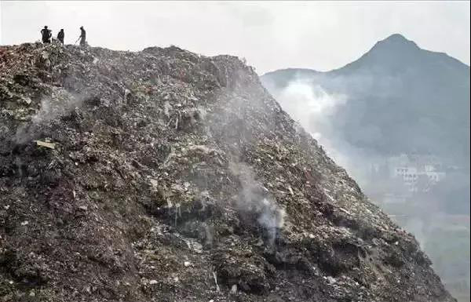
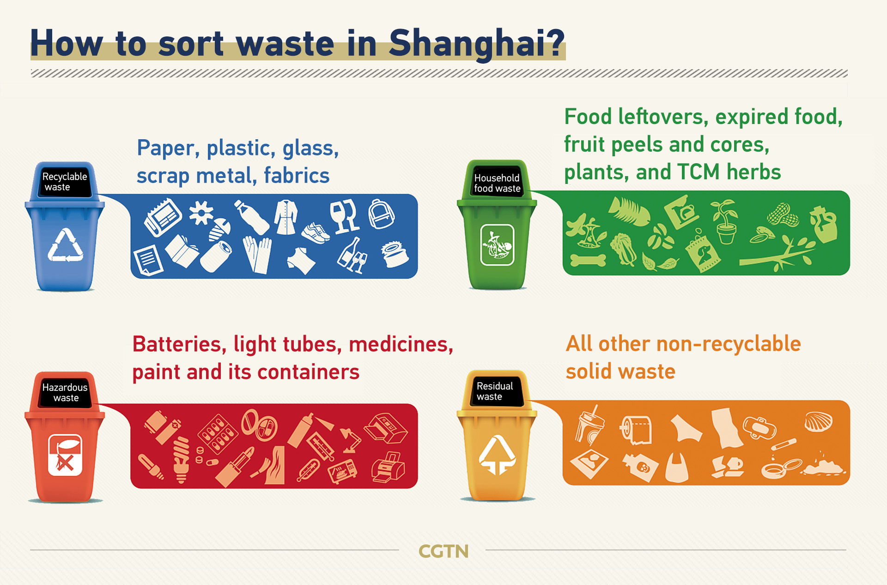
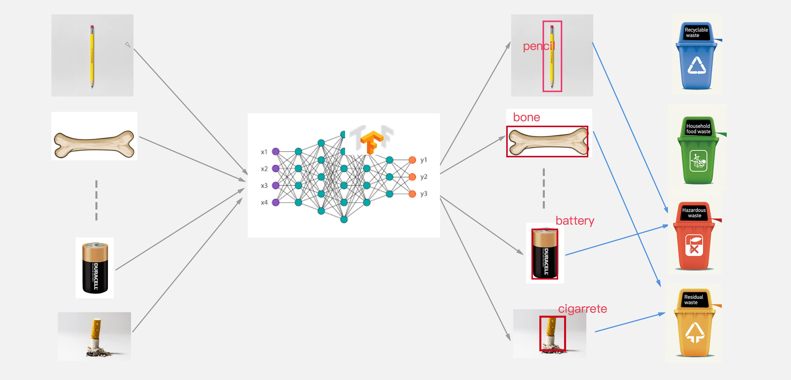
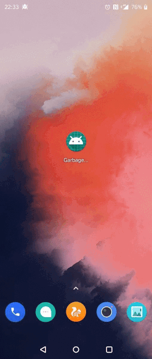
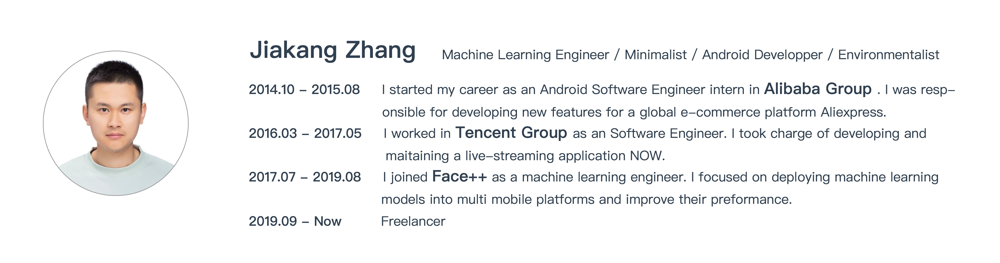

# Garbage Sorting Assistant

**Power Environmental Protection by Machine Learning**

Inspired by [Android Developer Challenge](https://developer.android.google.cn/dev-challenge), I come up with an idea.

This project aims to build an **Android application** which uses **machine learning** to classify garbage and guide people to put them into the right waste bins.

## Why we need Garbage Sorting

In today's material world, we human beings generate huge sum of waste in our daily life. Many cities are inundated with the large number of wastes and finding a proper place to arrange them is becoming a serious problem.

For individuals, some may believe disposing waste is effortless because they just need to pack it up and then throw it into a waste bin. At the city level, however, it is not exaggerating to say that it is almost a war every day to cope with those waste.
And the situation will be even worse in the future, according to the World Bank’s new What a Waste 2.0:  [A Global Snapshot of Solid Waste Management to 2050 report](https://openknowledge.worldbank.org/handle/10986/30317)

However, for the better part of the century, many countries are still disposing waste with traditional ways such as incinerating, compost and landfill. These methods are all inefficient and pose a great burden to cities.

One solution to handle this problem is garbage sorting. The most significant benefits is that it helps recycling. If waste had been well categorized, then governments could save labour in separating the wheat from the chaff. Another point to make is that it is helpful to cope with different kinds of waste in different ways. For example, incomplete burning of waste will produce carcinogen which is harmful, so it is necessary to deal with wet waste in other ways than burning together with dry waste.

## Garbage Sorting in China

The problems brought by marching garbage are particularly serious in China. The statistics published by Chinese Ministry of Housing and Urban-Rural Development showed that more than 2/3 of big cities are surrounded by waste and about 1/4 of them have already got no proper space for more waste.

Chinese government has been instigating positive changes in policy with garbage collection since 2000. In the first period, citizens have been encouraged to sort household garbage voluntarily. At July 1th 2019, Shanghai became the first city started enforcing its regulation on domestic waste management and make garbage classification compulsory instead of voluntary. Later on, other big cities such as Beijing and Shenzhen have enacted or revised regulations on garbage classification to enhance the guidance of people's actions.

As we can see that as Chinese government and people are placing more and more emphasis on garbage collection, this regulation is going to be an important part of citizens' daily routine for a very long time.

## Difficulties in instigating Garbage Sorting in China

The new regulation requires people to sort trash into four categories - household food waste, recyclables hazardous waste, and residual waste. Individuals and companies who fail to do so may be fined up to 50,000 yuan.

After a few months' observation, the major hurdle has been found is not people's willingness to sort their trash, instead, it is that they are often confused with how to sort some vague items.

The image is a guidance for how to match common waste with the bins. As we can see, the rules are a bit tricky, and it can be hard for some people to memorize. Even often there is brief guidance behind the bins, finding the right one is demanding and  time-consuming. 
 

In addition, for those uncommon waste, most people just throw by guessing because looking up a notebook is both demanding and time-consuming.  

For example, which bin of the four (household food waste, recyclables hazardous waste, and residual waste) do you think a "pencil" should be in? Well, the first one to the mind is "Recyclables" because I believe someone may want to reuse it. Then I would be fined because pencil contains lead which is noxious, it belongs to the "Hazardous waste" bin. It really needs some knowledge of chemistry, don't it?
There are also some examples out of my knowledge, such as mirror which belongs to hazardous, tabacco(residual waste) ect.

## How my idea can help with Garbage Sorting

So I alight upon on an idea of **building an Android application which contains an offline tensorflow model** to help people sort the garbage seeing that machine learning is powerful in object recognization and Android has largest user group across the world.

#### Model Design

A model will be trained on **TensorFlow** with a wide range of waste images which have been collected and labeled. The output of the network will be the category of the waste, then we will match it with the corresponding waste bin. 

#### Android Application

The next step is to make the machine learning model into real product. TensorFlow provides the ability to run across platform, and thus the model file can be converted and loaded in Android application.

#### A typicle scenario

When a user opens "Garbage sorting" application, the network will be loaded first. If the user clicks the "sort" button, then frames from the camera will be input to the network and the result which contains category of the waste and corresponding bin will be displayed after classification.

### About me

